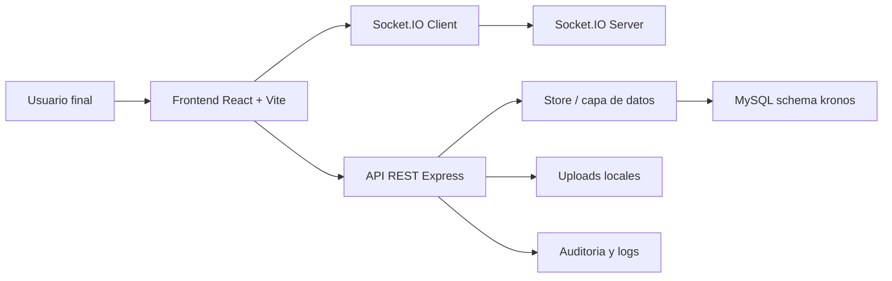

# Documentacion Tecnica

## 1. Objetivo
La plataforma `Kronos` es un sistema web de control de acceso y asistencia para operaciones multi-sucursal. Permite registrar entradas y salidas con validacion por geocerca, gestionar empleados, sucursales, grupos, incidencias, horarios, auditoria y monitoreo operativo en tiempo real.

## 2. Alcance funcional
- Control de acceso por geolocalizacion y flujo de cuatro registros diarios.
- Registro manual y correccion manual con trazabilidad.
- Gestion de empleados, sucursales, puestos, horarios y grupos de sucursales.
- Flujo de incidencias y aclaraciones con autorizacion.
- Reportes operativos y exportacion.
- Auditoria de cambios del sistema.
- Notificaciones en tiempo real y tablero de salud de plataforma.

## 3. Arquitectura general
La solucion sigue una arquitectura web cliente-servidor:



## 4. Componentes del backend

### 4.1 Punto de entrada
- Archivo: `backend/server.js`
- Responsabilidades:
  - Cargar variables de entorno.
  - Iniciar Express y Socket.IO.
  - Aplicar middlewares globales.
  - Refrescar snapshot desde MySQL en lecturas.
  - Exponer `/api/health`.

### 4.2 Middlewares
- `auth.js`
  - Firma y valida JWT.
  - Hashea contrasenas y soporta migracion de texto plano a bcrypt.
- `roles.js`
  - Define roles del sistema y restricciones por endpoint.
- `auditoria.middleware.js`
  - Intercepta operaciones de escritura y registra cambios de negocio.

### 4.3 Capa de datos
- Archivo principal: `backend/src/data/store.js`
- Funcion:
  - Mantiene una API interna estable para las rutas.
  - Hidrata datos desde MySQL.
  - Sincroniza snapshots a la base de datos.
  - Soporta fallback en memoria si la base no esta disponible.

### 4.4 Servicios
- `notificaciones.service.js`
  - Emite eventos de negocio a Socket.IO.
- `storage.service.js`
  - Abstrae almacenamiento de archivos.
- `logs.service.js`
  - Consolida metricas y errores operativos.

### 4.5 Utilerias
- `geo.js`: calculo Haversine para geocercas.
- `minutos.js`: calculo de minutos trabajados.
- `access-scope.js`: define alcance por rol, sucursal y grupo.

## 5. Componentes del frontend

### 5.1 Shell de aplicacion
- `frontend/src/App.jsx`
  - Define rutas publicas y protegidas.
- `frontend/src/components/Layout.jsx`
  - Sidebar, topbar, perfil, branding y navegacion.
- `frontend/src/components/ProtectedRoute.jsx`
  - Controla acceso por modulo y autenticacion.

### 5.2 Contextos
- `AuthContext.jsx`
  - Sesion, token, perfil y modulos habilitados.
- `EmpresaContext.jsx`
  - Branding institucional.
- `SocketContext.jsx`
  - Conexion a eventos en tiempo real.
- `NotificacionesContext.jsx`
  - Estado de notificaciones.
- `ThemeContext.jsx`
  - Tema visual.

### 5.3 Paginas principales
- `Login.jsx`: autenticacion.
- `Dashboard.jsx`: acceso diario y resumen personal.
- `Eventos.jsx`: feed en tiempo real.
- `Usuarios.jsx`: CRUD de personal.
- `Sucursales.jsx`: geocercas y sedes.
- `Registros.jsx`: historial, altas y validaciones.
- `Incidencias.jsx`: gestion y aprobacion.
- `Reportes.jsx`: indicadores y exportacion.
- `Admin.jsx`: configuracion maestra.
- `Grupos.jsx`: agrupacion territorial.
- `Mapa.jsx`: visualizacion geografica.
- `Perfil.jsx`: gestion de perfil propio.
- `Auditoria.jsx`: eventos de cambio.
- `Logs.jsx`: salud y errores.

## 6. Roles del sistema
- `super_admin`
- `agente_soporte_ti`
- `supervisor_sucursales`
- `agente_control_asistencia`
- `visor_reportes`
- `medico_titular`
- `medico_de_guardia`

Los modulos visibles por rol son configurables desde administracion y persistidos en `roles`, `modulos` y `rol_modulo`.

## 7. Modelo de datos
El sistema opera sobre el schema `kronos` en MySQL. Entidades principales:
- `usuarios`
- `sucursales`
- `horarios`
- `horario_dias`
- `puestos`
- `puesto_campos_extra`
- `grupos`
- `grupo_sucursales`
- `registros`
- `incidencias`
- `tipos_incidencia`
- `notificaciones`
- `auditoria_eventos`
- `empresa_config`
- `roles`
- `modulos`
- `rol_modulo`

## 8. Flujo de registro de asistencia
1. El usuario inicia sesion.
2. El frontend obtiene perfil y modulos.
3. El usuario registra su evento con GPS.
4. El backend valida token, sucursal y geocerca.
5. Se define el siguiente tipo de registro del dia.
6. Se persiste el registro.
7. Se emite evento en tiempo real.
8. Se actualiza auditoria si el evento es de escritura relevante.

## 9. Flujo de registros manuales
1. Personal autorizado captura un registro manual.
2. El backend valida el alcance sobre el empleado y la sucursal.
3. El registro queda marcado como manual.
4. Supervisores, soporte TI o super admin pueden editarlo.
5. Toda correccion manual queda identificada como cambio manual.

## 10. Flujo de incidencias y aclaraciones
### Incidencias
1. El empleado registra una incidencia.
2. El supervisor o super admin la aprueba o rechaza.
3. El sistema notifica a los involucrados.

### Aclaraciones
1. El empleado registra una aclaracion sobre un evento de horario.
2. El area de supervision la revisa.
3. Se documenta la resolucion y comentario del supervisor.

## 11. Seguridad
- JWT de 8 horas.
- Control por rol y alcance territorial.
- Auditoria de operaciones de escritura.
- Sanitizacion de datos sensibles en logs.
- Validacion de geocerca.
- Restricciones por sucursal y grupo.

## 12. Monitoreo y salud
- `/api/health` expone estado del backend y de la base de datos.
- `/api/logs/salud` expone metricas para administracion.
- `/api/logs/errores` permite revisar buffer operativo.

## 13. Instalacion en ambiente local

### Requisitos
- Node.js 18+
- npm 9+
- MySQL 8+

### Variables de entorno backend
Archivo sugerido: `backend/.env`

```env
PORT=4000
FRONTEND_URL=http://localhost:3000
JWT_SECRET=clave_segura_larga

DB_ENABLED=true
DB_HOST=127.0.0.1
DB_PORT=3306
DB_NAME=kronos
DB_USER=root
DB_PASSWORD=tu_password
DB_CONNECTION_LIMIT=10
```

### Arranque
```bash
cd backend
npm install
npm start
```

```bash
cd frontend
npm install
npm run dev
```

## 14. Instalacion en nube
Recomendacion de despliegue:
- Frontend: Vercel
- Backend Node: Railway, Render, Azure App Service o VM
- Base de datos: Azure Database for MySQL Flexible Server o equivalente
- Almacenamiento de archivos: Azure Blob Storage o S3 compatible

## 15. Riesgos actuales y consideraciones
- Persistencia por snapshot: adecuada para la fase actual, pero no ideal para operaciones altamente concurrentes.
- `uploads` locales: no adecuado para produccion en serverless.
- Socket.IO requiere backend persistente; no conviene desplegarlo directamente en Vercel.
- Se recomienda separar frontend y backend al pasar a productivo.

## 16. Recomendaciones de evolucion
- Migrar de snapshot a consultas SQL directas por modulo.
- Externalizar archivos a blob storage.
- Incorporar biometria o prueba de vida para fortalecer identidad del empleado.
- Automatizar respaldos, monitoreo y alertas.
- Implementar pruebas automatizadas y pipeline CI/CD.

## 17. Inventario de artefactos entregables
- Codigo fuente frontend y backend.
- Scripts y configuracion para MySQL.
- Documentacion tecnica.
- Manuales de usuario.
- Documento ejecutivo.
- Acta de entrega formal.
